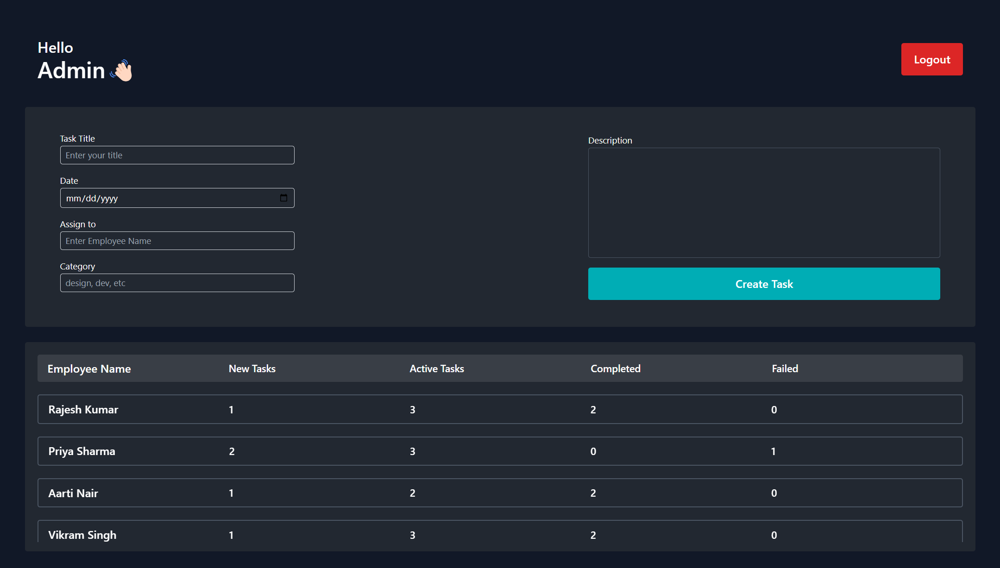
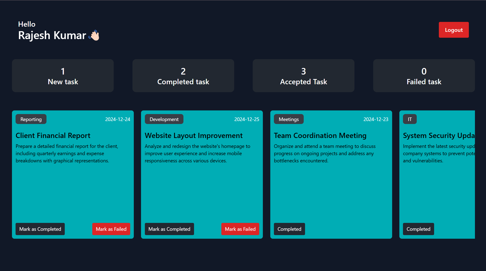
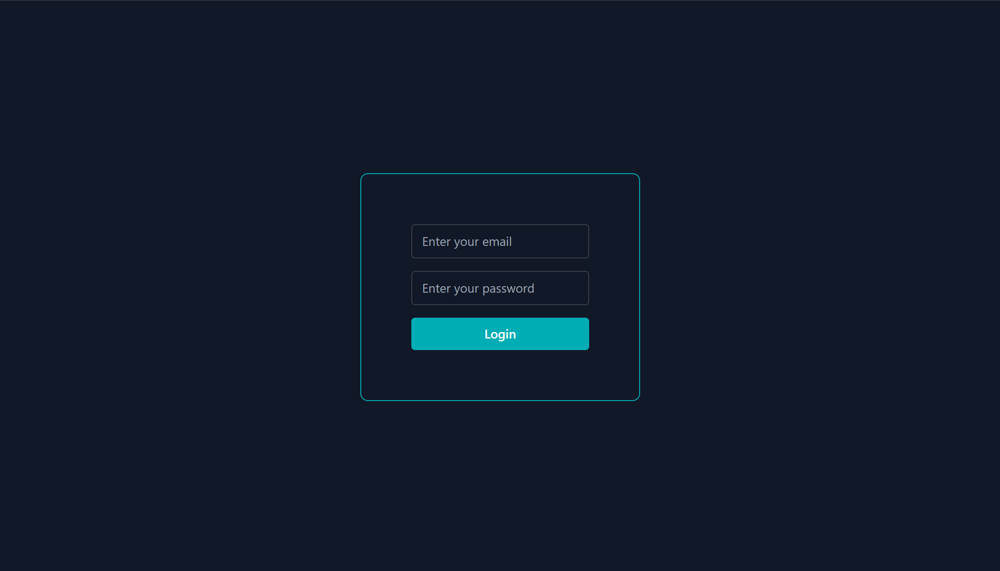

# Employee Management System

This is an Employee Management System built using React.js and Vite bundler, with local storage utilized as the database. The application allows an admin to create tasks, assign them to employees, and track their progress. Employees can accept, complete, or fail tasks based on the situation. The application features a clean and responsive user interface.

## Features

### Admin Features
- **Create Task**: Admin can create tasks by specifying a title, date, employee name, category, and description.
- **Assign Tasks**: Tasks can be assigned to a specific employee.
- **Task Status Tracking**: View the number of tasks that are new, active, completed, or failed for each employee.

### Employee Features
- **Accept Tasks**: Employees can accept tasks assigned to them.
- **Mark Tasks as Completed or Failed**: Employees can mark tasks as completed or failed based on their progress.

### Authentication
- **User Login**: A simple login system to differentiate between Admin and Employees.
- **Logout**: Users can log out, and the application will clear the session data.

### Additional Features
- **Context API**: Used for state management across the application.
- **Responsive Design**: Ensures the application works seamlessly on various screen sizes.

## Tech Stack
- **Frontend**: React.js
- **Bundler**: Vite
- **State Management**: Context API
- **Database**: Local Storage
- **Styling**: Tailwind CSS

## Installation

1. Clone the repository:
   ```bash
   git clone <repository_url>
   ```

2. Navigate to the project directory:
   ```bash
   cd employee-management-system
   ```

3. Install dependencies:
   ```bash
   npm install
   ```

4. Run the development server:
   ```bash
   npm run dev
   ```

5. Open your browser and go to:
   ```
   http://localhost:5173
   ```

## Usage

### Admin View
1. Log in as Admin.
2. Create and assign tasks to employees.
3. Track the progress of tasks using the dashboard.

### Employee View
1. Log in as an Employee.
2. View tasks assigned by the Admin.
3. Accept tasks and update their status as completed or failed.

## Screenshots

### Admin Dashboard


### Employee Dashboard


### Login Page


## Folder Structure
```
.
├── public
├── src
│   ├── components
│   │   ├── Admin
│   │   ├── Employee
│   │   ├── Shared
│   ├── context
│   ├── utils
│   ├── App.jsx
│   ├── main.jsx
├── package.json
├── tailwind.config.js
├── vite.config.js
```
## Dummy User
   email = employe1@example.com
   password = 123
## Contributing
Contributions are welcome! If you'd like to improve this project, feel free to fork the repository and create a pull request.

## License
This project is licensed under the MIT License. See the `LICENSE` file for details.

## Author
Developed by vishal.
